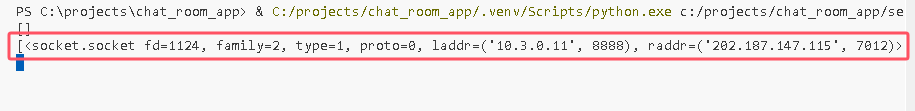

# Chat Room Application

Author: ZHAO ZIHAO

Python chatroom application based on socket programming.

- **Mode:** C/S model
- **Environment**: Python 3.x (3.12.4 Recommended)

## Dependency package

- Socket transport - socket
- GUI - tkinter and ttkbootstrap
- Multi-client - threading
- Encryption - cryptography

The whole requirements are in the file requirements.txt

use this to get all of them:

```python
pip install -r requirements.txt
```

---

## Usage

### 1. Run server

Run the server file **server.py**

```cmd
python .\server.py
```

Default IP and port. To receive connections from all network interfaces, including local, local LAN, and public network client requests.

```python
HOST = '0.0.0.0'
PORT = 8888
```

### 2. Run client

Need to set username and server_ip after ran the client.

If you don't input server_ip, the app will use default server ip = 127.0.0.1.

If want to connect to other server, please input its IP.(My Cloud Server: 43.134.64.229)


If succeed to connect, the server terminal will show the information of client.



---

## Features

### Multiple users, multiple clients, remote server

Multiple users and multiple clients can chat simultaneously, with real-time message transmission, achieving functionality similar to group chat.


### User list

The user list can display online users, their status, and IP addresses.

As shown below:

**This feature is still under development.**

### Message encryption

Fernet is a symmetric encryption mechanism, specifically using the Fernet encryption algorithm.

Fernet uses symmetric key encryption, meaning the same key is used for both encryption and decryption. 

Only the party with the key can decrypt the message.

